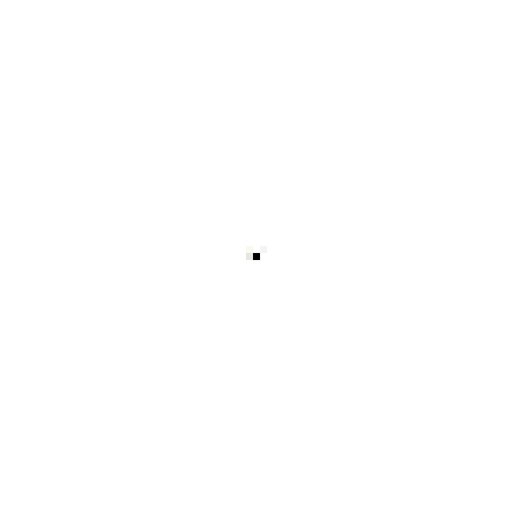
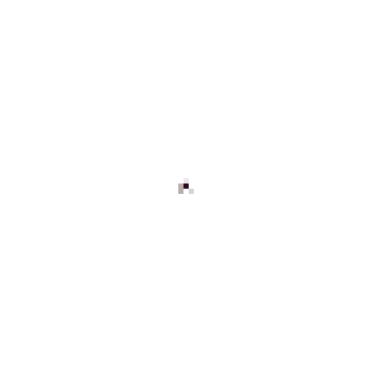

# Neural Cellular Automata Web UI

This project provides an interactive, web-based user interface for training and running "Growing" Neural Cellular Automata (NCA) models, inspired by the research paper and Distill article ["Growing Neural Cellular Automata"](https://distill.pub/2020/growing-ca/).

The application is built with a Python backend using Flask and TensorFlow for the core NCA logic, and a vanilla JavaScript frontend for a dynamic user experience. It allows users to define target patterns, train models in real-time, observe their growth, and interact with the resulting automata in a separate "runner" environment.

<table align="center">
  <thead>
    <tr>
      <th align="center" width="150px">Model</th>
      <th align="center">Growing</th>
      <th align="center">Persistent</th>
      <th align="center">Regenerating</th>
    </tr>
  </thead>
  <tbody>
    <!-- Row for the Plant Model -->
    <tr>
      <td align="center"><b>Plant</b></td>
      <td align="center">
        <a>
          
        </a>
      </td>
      <td align="center">
        <a>
          
        </a>
      </td>
      <td align="center">
        <a>
          
        </a>
      </td>
    </tr>
    <!-- Row for the Goldfish Model -->
    <tr>
      <td align="center"><b>Goldfish</b></td>
      <td align="center">
        <a>
          
        </a>
      </td>
      <td align="center">
        <a>
          
        </a>
      </td>
      <td align="center">
        <a>
          
        </a>
      </td>
    </tr>
    <!-- Row for the Snail Model -->
    <tr>
      <td align="center"><b>Snail</b></td>
      <td align="center">
        <a>
          
        </a>
      </td>
      <td align="center">
        <a>
          
        </a>
      </td>
      <td align="center">
        <a>
          
        </a>
      </td>
    </tr>
    <!-- Add more rows here for other models -->
  </tbody>
</table>

## Live Demo

A standalone, JavaScript-only showcase of the trained models is available for interaction. This demo runs entirely in the browser using WebGL and can be hosted on static sites like GitHub Pages.

**[➡️ View the Live Demo Here](https://semvdn.github.io/Growing-NCA-WebUI/)**

## Key Features

-   **Interactive Target Creation**: Draw your own target patterns directly on an HTML5 canvas or upload an image file.
-   **Multiple Training Regimens**: Train models using three distinct experiment types:
    -   **Growing**: Trains the model to grow from a single seed into the target pattern.
    -   **Persistent**: Trains the model to not only grow but also maintain its form over time.
    -   **Regenerating**: Trains a persistent model to be robust to damage by erasing parts of the pattern during training.
-   **Live Training Preview**: Watch your NCA model learn and grow in real-time directly in your browser.
-   **Model Management**: Save trained models (weights, metadata, and JavaScript-runnable formats) and reload them later to continue training.
-   **Interactive Runner**: Load trained models into a separate simulation environment to experiment with them.
-   **Dynamic Interaction**: Interact with the running NCA using color draw and erase tools, adjust the simulation speed, and inject noise (entropy) to observe the model's robustness and emergent behaviors.

## Project Structure

```
/
├── app.py                      # Main Flask application entry point.
├── app_state.py                # Centralized state management for the web app.
├── app_routes_trainer.py       # Flask routes for the Training tab.
├── app_routes_runner.py        # Flask routes for the Runner tab.
├── app_utils.py                # Utility functions.
│
├── nca_globals.py              # Global constants (grid size, channels, etc.).
├── nca_model.py                # TensorFlow/Keras definition of the CA model.
├── nca_trainer.py              # The NCATrainer class for the training loop.
├── nca_runner.py               # The NCARunner class for the simulation loop.
├── nca_utils.py                # Utilities for image processing and model summaries.
├── model_converter.py          # Functions to export models to JS formats.
│
├── train_and_convert.py        # CLI script to train models for the demo.
│
├── static/                     # Frontend assets for the main web app.
│   └── js/
├── templates/
│   └── index.html              # HTML for the main web app.
│
├── demo/                       # Standalone, static showcase application.
│   ├── index.html              # The HTML page for the demo.
│   ├── ca.js                   # Core WebGL and shader logic for the demo.
│   ├── demo.js                 # UI and application logic for the demo.
│   ├── models.json             # Manifest of available models for the demo.
│   ├── h5_models/              # Directory for h5 model files.
│   └── webgl_models/           # Directory for quantized model files.
│
├── uploads/                    # Default directory for uploaded target images.
└── models/                     # Default directory for saved model checkpoints and runs.
```

## Setup and Installation (Main Web App)

### Prerequisites

-   Python 3.9+
-   An NVIDIA GPU with CUDA and cuDNN installed is **highly recommended** for acceptable training performance.

### Installation Steps

1.  **Clone the repository:**
    ```bash
    git clone <your-repository-url>
    cd <your-repository-name>
    ```

2.  **Create and activate a virtual environment:**
    ```bash
    # Using venv
    python -m venv venv
    source venv/bin/activate  # On Windows, use `venv\Scripts\activate`

    # Or using conda
    conda create -n nca python=3.11
    conda activate nca
    ```

3.  **Install the required Python packages:**
    Create a `requirements.txt` file with the following content and install it.
    ```
    # requirements.txt
    Flask
    tensorflow[and-cuda]
    numpy
    Pillow
    werkzeug
    ```
    Then run:
    ```bash
    pip install -r requirements.txt
    ```

### Running the Application

Once the setup is complete, you can start the Flask development server from the project root directory:

```bash
python app.py
```

The application will start, and you will see output indicating the server is running, including the local URL (usually `http://127.0.0.1:5000`). Open this URL in your web browser to access the Web UI.

## User Guide (Main Web App)

The application is split into two main tabs: **Training** and **Run NCA**.

### Training a New Model

1.  **Define a Target Pattern:**
    -   **Option A: Draw a Pattern**: Use the canvas on the right. You can select a color, brush size, and opacity. Use the "Eraser Mode" checkbox to erase. When you are happy with your drawing, give it a name and click **"Confirm Drawing as Target"**.
    -   **Option B: Upload an Image**: Click **"Choose File"**, select an image (64x64 PNG with transparency works best), and click **"Load Image File for Trainer"**.

2.  **Configure and Initialize Training:**
    -   In the "Configure Training" section, select your desired **Experiment Type** (`Growing`, `Persistent`, or `Regenerating`).
    -   Adjust other parameters like Fire Rate, Batch Size, etc., if needed.
    -   Click **"Initialize Trainer with Target"**.

3.  **Start Training:**
    -   Click **"Start Training"**. The training loop will begin on the server.
    -   The preview area will update in real-time to show the current state of a sample from the training pool.
    -   The status box will show the current step, loss, and total training time.
    -   Click **"Stop Training"** at any time to pause. The model's state and weights will be preserved.

4.  **Save the Model:**
    -   Once you are satisfied with the training progress, click **"Save Trained Model"**.
    -   This creates a new sub-directory in the `models/` folder, saving the `.h5` weights, metadata, and exported JS models.

### Running and Interacting with a Model

1.  **Load a Model:**
    -   **Option A: Load from Current Training**: If you have a training session in the "Training" tab, click **"Load Current Training Model"**.
    -   **Option B: Load from File**: Click **"Choose File"**, navigate to a `models/` sub-directory, and select a `.weights.h5` file. Click **"Load from File"**.

2.  **Run the Simulation:**
    -   Click **"Start Running Loop"**. The NCA simulation will begin.
    -   Use the **Speed** slider to control the simulation's target FPS.
    -   Click **"Reset Runner State to Seed"** to clear the grid and start again from a single living cell.

3.  **Interact with the NCA:**
    -   **Tool Mode**: Select "Erase" or "Draw" to modify the grid.
    -   **Brush Size**: Adjust the size of your interaction tool.
    -   **Draw Color**: When in "Draw" mode, select a color to paint new cells onto the canvas.
    -   **Entropy Dynamics**: Check "Enable Entropy" to add random noise to the NCA's state at each step and use the **Strength** slider to control the amount.
